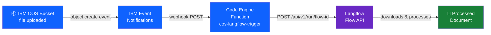
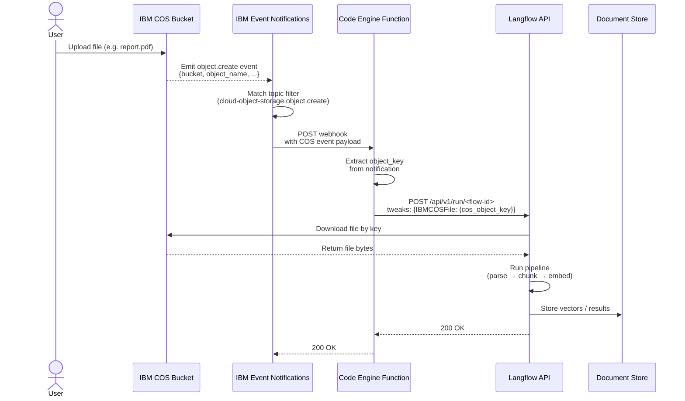

# COS → Langflow Auto-Trigger Setup

## Quick Start (Automated)

**TL;DR:** Configure your environment and run the setup script:

```bash
# 1. Copy the example environment file
cp .env.example .env

# 2. Edit .env with your actual values
nano .env  # or use your preferred editor

# 3. Run the setup script
./setup.sh
```

This will automatically:
- Install required IBM Cloud CLI plugins
- Create Event Notifications instance
- Enable activity tracking on your COS bucket
- Deploy the Code Engine function
- Configure topics, destinations, and subscriptions

To remove everything:

```bash
./teardown.sh
```

> **Security Note:** The `.env` file contains sensitive credentials and is excluded from git via [`.gitignore`](.gitignore). Never commit this file to version control.

For manual step-by-step setup, see the detailed instructions below.

---

## Architecture



## Solution Flow



---

## Step 1: Prepare Your Langflow Flow

1. Open your flow in Langflow
2. Click the **API** button
3. Note your endpoint:
   ```
   POST https://<your-langflow-host>/api/v1/run/<flow-id>
   ```
4. Go to **Settings → API Keys** and copy your API key
5. Add these values to your `.env` file:
   ```bash
   LANGFLOW_URL=https://your-langflow-host/api/v1/run/your-flow-id?stream=false
   LANGFLOW_API_KEY=your-api-key
   ```

---

## Step 2: Create the Code Engine Function

### 2a. Create project

```bash
ibmcloud plugin install code-engine
ibmcloud ce project create --name langflow-triggers
ibmcloud ce project select --name langflow-triggers
```

### 2b. Write the function (`main.py`)

```python
import os
import requests

def main(params):
    notification = params.get("data", {}).get("notification", {})
    object_key   = notification.get("object_name", "")
    bucket       = notification.get("bucket_name", "")

    if not object_key or object_key.endswith("/"):
        return {"status": "skipped", "reason": "directory marker or empty key"}

    langflow_url     = os.environ["LANGFLOW_URL"]
    langflow_api_key = os.environ["LANGFLOW_API_KEY"]
    component_id     = os.environ.get("COS_COMPONENT_ID", "IBMCOSFile")

    payload = {
        "input_value": f"New file uploaded: {object_key}",
        "tweaks": {
            component_id: {
                "cos_object_key": object_key
            }
        }
    }

    resp = requests.post(
        langflow_url,
        json=payload,
        headers={
            "x-api-key": langflow_api_key,
            "Content-Type": "application/json"
        },
        timeout=30
    )

    return {
        "status": "triggered",
        "object_key": object_key,
        "bucket": bucket,
        "langflow_status": resp.status_code
    }
```

### 2c. Deploy the function

```bash
ibmcloud ce fn create \
  --name cos-langflow-trigger \
  --runtime python-3.12 \
  --build-source . \
  --env LANGFLOW_URL="http://169.61.49.180/api/v1/run/bfb6f30f-7d32-41c5-8f35-ceaf5e92954a?stream=false" \
  --env LANGFLOW_API_KEY="sk-kuTuloaUuT2oBIDTa-RqQc_kqbCTBimWXPdm7BTUPdE" \
  --env COS_COMPONENT_ID="IBMCOSFile"
```

Note the function URL from the output:
```
https://cos-langflow-trigger.<region>.codeengine.appdomain.cloud
```

---

## Step 3: Create IBM Event Notifications Instance

```bash
ibmcloud resource service-instance-create event-notifications-langflow \
  event-notifications lite us-south
```

Or via console: **IBM Cloud Catalog → Event Notifications → Create (Lite plan)**

---

## Step 4: Enable Activity Tracking on Your COS Bucket

> **Note:** The `ibmcloud cos` CLI plugin (v1.10.5, latest) does **not** include a `bucket-activity-tracking-put` command. Use the IBM Cloud Resource Configuration REST API directly via `curl` instead.

> **Constraint:** IBM COS requires `management_events: true` whenever an `activity_tracker_crn` is specified. You cannot set `write_data_events` without also enabling `management_events`.

```bash
# 1. Obtain an IAM bearer token
IAM_TOKEN=$(ibmcloud iam oauth-tokens | grep "IAM token" | awk '{print $4}')

# 2. PATCH the bucket configuration
curl -X PATCH \
  "https://config.cloud-object-storage.cloud.ibm.com/v1/b/<your-bucket-name>" \
  -H "Authorization: Bearer ${IAM_TOKEN}" \
  -H "Content-Type: application/json" \
  -d '{
    "activity_tracking": {
      "activity_tracker_crn": "<your-event-notifications-crn>",
      "write_data_events": true,
      "management_events": true
    }
  }'

# 3. Verify the configuration was applied (expect 200 with activity_tracking block)
curl -s \
  "https://config.cloud-object-storage.cloud.ibm.com/v1/b/<your-bucket-name>" \
  -H "Authorization: Bearer ${IAM_TOKEN}" | python3 -m json.tool
```

> Get the Event Notifications CRN from your instance dashboard under **Details**.
> A successful PATCH returns an empty `204 No Content` response.

---

## Step 5: Create Topic in Event Notifications

```bash
# Install the Event Notifications plugin (once)
ibmcloud plugin install event-notifications

# Derive EN_INSTANCE_ID, RLE_SOURCE_ID, and COS_BUCKET_CRN in one step
BUCKET_NAME="<your-bucket-name>"
IAM_TOKEN=$(ibmcloud iam oauth-tokens | grep "IAM token" | awk '{print $4}')

ENV_VARS=$(python3 - <<EOF
import subprocess, json, re, urllib.request

# --- Event Notifications instance ---
result = subprocess.run(
    ["ibmcloud", "resource", "service-instances", "--service-name", "event-notifications", "--output", "json"],
    capture_output=True, text=True
)
instances = json.loads(result.stdout)
i = instances[0]  # change index if you have multiple EN instances
crn = i["crn"]
guid = i["guid"]
account_id = re.search(r":a/([^:]+):", crn).group(1)
rle_source_id = f"crn:v1:bluemix:public:resource-lifecycle-events:global:a/{account_id}:{guid}::"

# --- COS bucket CRN via Resource Configuration API ---
import os
iam_token = os.environ["IAM_TOKEN"]
req = urllib.request.Request(
    f"https://config.cloud-object-storage.cloud.ibm.com/v1/b/$BUCKET_NAME",
    headers={"Authorization": f"Bearer {iam_token}"}
)
with urllib.request.urlopen(req) as resp:
    bucket_crn = json.loads(resp.read())["crn"]

print(f"EN_INSTANCE_ID={guid}")
print(f"RLE_SOURCE_ID={rle_source_id}")
print(f"COS_BUCKET_CRN={bucket_crn}")
EOF
)
eval "$ENV_VARS"
echo "EN_INSTANCE_ID = $EN_INSTANCE_ID"
echo "RLE_SOURCE_ID  = $RLE_SOURCE_ID"
echo "COS_BUCKET_CRN = $COS_BUCKET_CRN"

# Set the working instance
ibmcloud event-notifications init --instance-id "$EN_INSTANCE_ID"

# Enable the IBM Cloud Resource Lifecycle Events source (required for COS events)
ibmcloud event-notifications source-update \
  --instance-id "$EN_INSTANCE_ID" \
  --id "$RLE_SOURCE_ID" \
  --enabled=true

# Create the topic (or update it if it already exists)
TOPIC_ID=$(ibmcloud event-notifications topics --instance-id "$EN_INSTANCE_ID" --output json \
  | python3 -c "import sys,json; t=[x for x in json.load(sys.stdin)['topics'] if x['name']=='New COS Files']; print(t[0]['id'] if t else '')")

SOURCES_JSON="[{
  \"id\": \"${RLE_SOURCE_ID}\",
  \"rules\": [{
    \"enabled\": true,
    \"event_type_filter\": \"\$.notification_event_info.event_type == 'cloud-object-storage.object.create'\",
    \"notification_filter\": \"\$.notification.resources[0].crn == '${COS_BUCKET_CRN}'\"
  }]
}]"

if [ -z "$TOPIC_ID" ]; then
  # Topic does not exist — create it
  ibmcloud event-notifications topic-create \
    --instance-id "$EN_INSTANCE_ID" \
    --name "New COS Files" \
    --description "Triggers on new object uploads to COS bucket" \
    --sources "$SOURCES_JSON"
else
  # Topic already exists — update it
  echo "Topic already exists (id: $TOPIC_ID), updating..."
  ibmcloud event-notifications topic-replace \
    --instance-id "$EN_INSTANCE_ID" \
    --id "$TOPIC_ID" \
    --name "New COS Files" \
    --description "Triggers on new object uploads to COS bucket" \
    --sources "$SOURCES_JSON"
fi
```

> **Note:** The `notification_filter` scopes events to a specific bucket. Omit it to receive events from all COS buckets in the account.

---

## Step 6: Create Webhook Destination

```bash
CE_FUNCTION_URL="https://cos-langflow-trigger.us-south.codeengine.appdomain.cloud"

ibmcloud event-notifications destination-create \
  --instance-id "$EN_INSTANCE_ID" \
  --name "Langflow Trigger Webhook" \
  --type webhook \
  --config "{
    \"params\": {
      \"url\": \"${CE_FUNCTION_URL}\",
      \"verb\": \"post\",
      \"custom_headers\": {\"Content-Type\": \"application/json\"},
      \"sensitive_headers\": []
    }
  }"
```

> Note the `id` from the output — you'll need it in Step 7.

---

## Step 7: Create Subscription

```bash
TOPIC_ID="<topic-id-from-step-5-output>"
DESTINATION_ID="<destination-id-from-step-6-output>"

ibmcloud event-notifications subscription-create \
  --instance-id "$EN_INSTANCE_ID" \
  --name "COS to Langflow" \
  --topic-id "$TOPIC_ID" \
  --destination-id "$DESTINATION_ID"
```

---

## Step 8: Test the Pipeline

> **📖 For comprehensive testing and troubleshooting, see [`TESTING.md`](TESTING.md)**

Upload a test file to your bucket:

```bash
# Note: Specify --region if your bucket is in a specific region or uses smart tier
ibmcloud cos object-put \
  --bucket <your-bucket-name> \
  --key test/sample.pdf \
  --body ./sample.pdf \
  --region us-south
```

Then verify the function was triggered:

```bash
# Check function details and recent invocations
ibmcloud ce function get --name cos-langflow-trigger

# Or invoke the function directly to test
curl -X POST https://cos-langflow-trigger.<region>.codeengine.appdomain.cloud \
  -H "Content-Type: application/json" \
  -d '{
    "data": {
      "notification": {
        "object_name": "test/sample.pdf",
        "bucket_name": "prudential-langflow"
      }
    }
  }'
```

> **Note:** Code Engine function logs are available through IBM Cloud Logging. To view detailed logs, configure logging for your Code Engine project in the IBM Cloud console.

---

## Summary

| Step | Where | What |
|------|-------|-------|
| 1 | Langflow | Copy flow API URL + API key |
| 2 | Code Engine | Deploy trigger function |
| 3 | IBM Cloud | Create Event Notifications instance |
| 4 | COS Bucket | Enable activity tracking → Event Notifications |
| 5 | Event Notifications | Create topic filtering `object.create` events |
| 6 | Event Notifications | Create webhook → Code Engine function URL |
| 7 | Event Notifications | Create subscription linking topic → webhook |
| 8 | CLI | Upload test file and verify logs |

---

## Teardown / Reset

Run these commands in order to remove all resources and start from scratch.

### 1. Delete EN subscriptions, destinations, and topics

```bash
EN_INSTANCE_ID=$(ibmcloud resource service-instances --service-name event-notifications --output json \
  | python3 -c "import sys,json; print(json.load(sys.stdin)[0]['guid'])")

# Delete all subscriptions
ibmcloud event-notifications subscriptions --instance-id "$EN_INSTANCE_ID" --output json \
  | python3 -c "import sys,json; [print(x['id']) for x in json.load(sys.stdin)['subscriptions']]" \
  | xargs -I{} ibmcloud event-notifications subscription-delete --instance-id "$EN_INSTANCE_ID" --id {} -f

# Delete custom webhook destinations (built-in IBM destinations cannot be deleted)
ibmcloud event-notifications destinations --instance-id "$EN_INSTANCE_ID" --output json \
  | python3 -c "
import sys, json
for d in json.load(sys.stdin)['destinations']:
    if d['type'] == 'webhook':
        print(d['id'])
" \
  | xargs -I{} ibmcloud event-notifications destination-delete --instance-id "$EN_INSTANCE_ID" --id {} -f

# Delete all topics
ibmcloud event-notifications topics --instance-id "$EN_INSTANCE_ID" --output json \
  | python3 -c "import sys,json; [print(x['id']) for x in json.load(sys.stdin)['topics']]" \
  | xargs -I{} ibmcloud event-notifications topic-delete --instance-id "$EN_INSTANCE_ID" --id {} -f

# Disable the Resource Lifecycle Events source
RLE_SOURCE_ID=$(ibmcloud event-notifications sources --instance-id "$EN_INSTANCE_ID" --output json \
  | python3 -c "
import sys, json
for s in json.load(sys.stdin)['sources']:
    if s['type'] == 'resource-lifecycle-events':
        print(s['id'])
")
ibmcloud event-notifications source-update \
  --instance-id "$EN_INSTANCE_ID" \
  --id "$RLE_SOURCE_ID" \
  --enabled=false
```

### 2. Delete the Event Notifications service instance

```bash
ibmcloud resource service-instance-delete event-notifications-langflow -f --recursive
```

### 3. Remove activity tracking from the COS bucket

```bash
BUCKET_NAME="prudential-langflow"
IAM_TOKEN=$(ibmcloud iam oauth-tokens | grep "IAM token" | awk '{print $4}')

curl -s -X PATCH \
  "https://config.cloud-object-storage.cloud.ibm.com/v1/b/${BUCKET_NAME}" \
  -H "Authorization: Bearer ${IAM_TOKEN}" \
  -H "Content-Type: application/json" \
  -d '{"activity_tracking": null}'
```

### 4. Delete the Code Engine function and project

```bash
# Delete the function
ibmcloud ce fn delete --name cos-langflow-trigger -f

# Optionally delete the entire Code Engine project
ibmcloud ce project delete --name langflow-triggers -f --hard
```