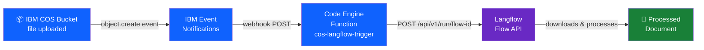
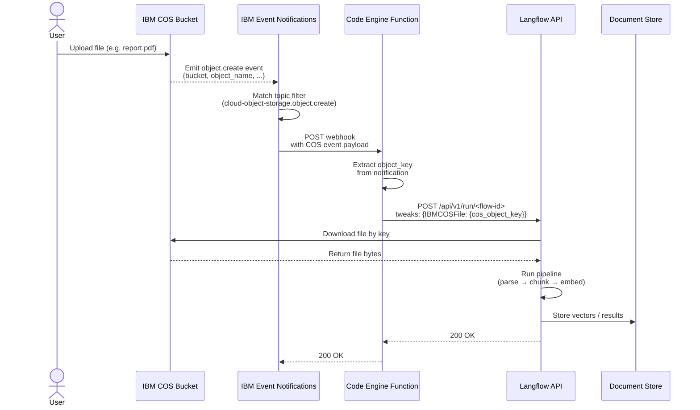

# COS → Langflow Auto-Trigger Setup

## Architecture



## Solution Flow



---

## Step 1: Prepare Your Langflow Flow

1. Open your flow in Langflow
2. Click the **API** button
3. Note your endpoint:
   ```
   POST https://<your-langflow-host>/api/v1/run/<flow-id>
   ```
4. Go to **Settings → API Keys** and copy your API key

---

## Step 2: Create the Code Engine Function

### 2a. Create project

```bash
ibmcloud ce project create --name langflow-triggers
ibmcloud ce project select --name langflow-triggers
```

### 2b. Write the function (`main.py`)

```python
import os
import requests

def main(params):
    notification = params.get("data", {}).get("notification", {})
    object_key   = notification.get("object_name", "")
    bucket       = notification.get("bucket_name", "")

    if not object_key or object_key.endswith("/"):
        return {"status": "skipped", "reason": "directory marker or empty key"}

    langflow_url     = os.environ["LANGFLOW_URL"]
    langflow_api_key = os.environ["LANGFLOW_API_KEY"]
    component_id     = os.environ.get("COS_COMPONENT_ID", "IBMCOSFile")

    payload = {
        "input_value": f"New file uploaded: {object_key}",
        "tweaks": {
            component_id: {
                "cos_object_key": object_key
            }
        }
    }

    resp = requests.post(
        langflow_url,
        json=payload,
        headers={
            "x-api-key": langflow_api_key,
            "Content-Type": "application/json"
        },
        timeout=30
    )

    return {
        "status": "triggered",
        "object_key": object_key,
        "bucket": bucket,
        "langflow_status": resp.status_code
    }
```

### 2c. Deploy the function

```bash
ibmcloud ce fn create \
  --name cos-langflow-trigger \
  --runtime python-3.12 \
  --build-source . \
  --env LANGFLOW_URL="https://<your-langflow-host>/api/v1/run/<flow-id>" \
  --env LANGFLOW_API_KEY="<your-langflow-api-key>" \
  --env COS_COMPONENT_ID="IBMCOSFile"
```

Note the function URL from the output:
```
https://cos-langflow-trigger.<region>.codeengine.appdomain.cloud
```

---

## Step 3: Create IBM Event Notifications Instance

```bash
ibmcloud resource service-instance-create event-notifications-langflow \
  event-notifications lite us-south
```

Or via console: **IBM Cloud Catalog → Event Notifications → Create (Lite plan)**

---

## Step 4: Enable Activity Tracking on Your COS Bucket

```bash
ibmcloud cos bucket-activity-tracking-put \
  --bucket <your-bucket-name> \
  --activity-tracking-config '{
    "activity_tracker_crn": "<your-event-notifications-crn>",
    "write_data_events": true,
    "management_events": false
  }'
```

> Get the CRN from your Event Notifications instance dashboard.

---

## Step 5: Create Topic in Event Notifications

1. Open your Event Notifications instance
2. Go to **Topics → Create**
3. Name: `New COS Files`
4. Add filter:
   - **Source:** your COS instance
   - **Event type:** `cloud-object-storage.object.create`
   - *(Optional)* Filter by bucket name

---

## Step 6: Create Webhook Destination

1. Go to **Destinations → Create**
2. Type: **Webhook**
3. URL: your Code Engine function URL
4. Method: `POST`
5. Headers:
   ```
   Content-Type: application/json
   ```

---

## Step 7: Create Subscription

1. Go to **Subscriptions → Create**
2. **Topic:** `New COS Files`
3. **Destination:** the webhook you created in Step 6

---

## Step 8: Test the Pipeline

Upload a test file to your bucket:

```bash
ibmcloud cos object-put \
  --bucket <your-bucket-name> \
  --key test/sample.pdf \
  --body ./sample.pdf
```

Then check your Code Engine function logs:

```bash
ibmcloud ce fn logs --name cos-langflow-trigger
```

---

## Summary

| Step | Where | What |
|------|-------|-------|
| 1 | Langflow | Copy flow API URL + API key |
| 2 | Code Engine | Deploy trigger function |
| 3 | IBM Cloud | Create Event Notifications instance |
| 4 | COS Bucket | Enable activity tracking → Event Notifications |
| 5 | Event Notifications | Create topic filtering `object.create` events |
| 6 | Event Notifications | Create webhook → Code Engine function URL |
| 7 | Event Notifications | Create subscription linking topic → webhook |
| 8 | CLI | Upload test file and verify logs |